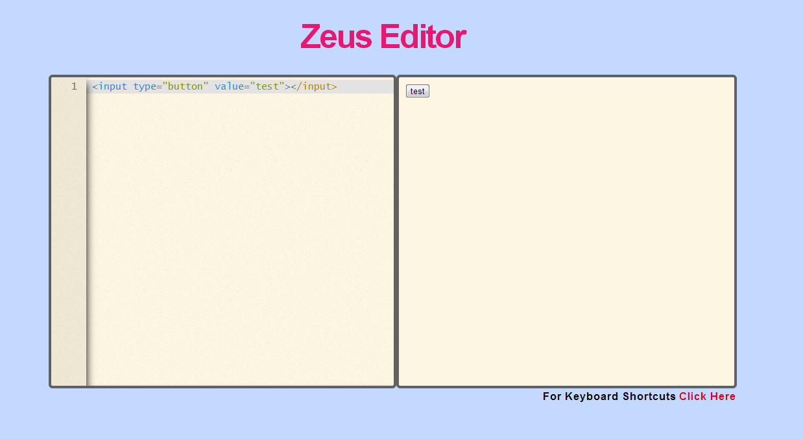

Z-Editor
============

## 什么是 Z-Editor ?

Z-Editor 是一个基于 codemirror 制作的动态编辑工具，目前支持 JShint, 动态编辑，两大功能。

## Z-Editor 能做什么 ?

如下图所示，只要在左端输入代码，右边能动态呈现效果。

## Z-Editor 使用说明?

下载项目后，打开 index.html 便可操作。F11 能全屏，F10 能调用 JSHint 检测代码，Ctrl + F 启动搜索功能。